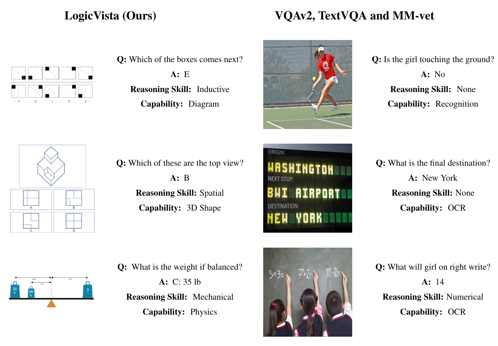
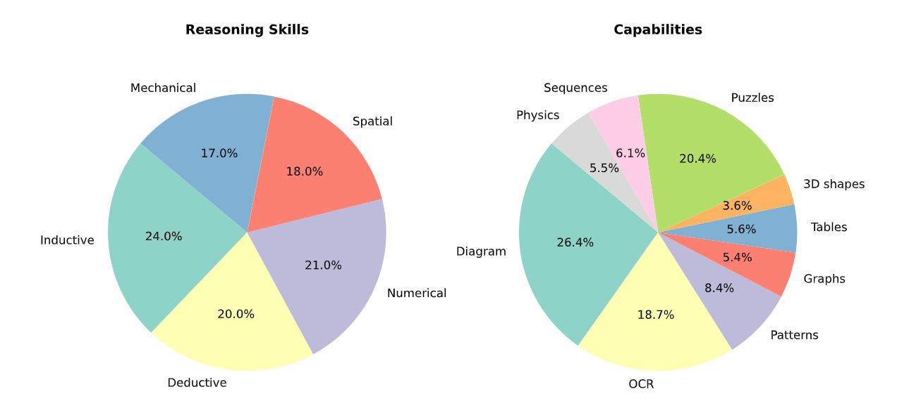

# LogicVista: A Benchmark for Evaluating Multimodal Logical Reasoning

## Overview
LogicVista aims to bridge the gap in understanding the proficiency of Multimodal Large Language Models (MLLMs) in fundamental logical reasoning within visual contexts. It evaluates models across five logical reasoning tasks: spatial, deductive, inductive, numeric, and mechanical reasoning, leveraging a diverse dataset of 448 visual multiple-choice questions.

## Dataset Breakdown
The LogicVista dataset is meticulously crafted to cover a wide range of logical reasoning abilities, with a total of 448 questions. The breakdown is as follows:

### Total: 448 Questions

### Capabilities
- **Diagram**: 330 questions
- **OCR (Optical Character Recognition)**: 234 questions
- **Patterns**: 105 questions
- **Graphs**: 67 questions
- **Tables**: 70 questions
- **3D Shapes**: 45 questions
- **Puzzles**: 256 questions
- **Sequences**: 76 questions
- **Physics**: 69 questions

### Reasoning Skills
- **Inductive Reasoning**: 107 questions
- **Deductive Reasoning**: 93 questions
- **Numerical Reasoning**: 95 questions
- **Spatial Reasoning**: 79 questions
- **Mechanical Reasoning**: 74 questions

This diverse set ensures a comprehensive assessment of MLLMs' logical reasoning capabilities in varied contexts.

## Dataset
The LogicVista dataset comprises visual questions that challenge MLLMs on various logical reasoning tasks. Each question is accompanied by manual annotations that detail the image, instruction, solution, and the reasoning process involved.
- **Location**: `data/`
- **Contents**: `dataset.json` and a collection of images in the `images/` folder.
- **More Details**: For a comprehensive understanding of the dataset structure and usage, refer to the [Data README](data/README.md).

## Evaluation
We provide a robust evaluation framework to assess MLLMs using LogicVista. This includes scripts for analysis, a standard set of answers for comparison, and detailed instructions for replicating our evaluation process.
- **Location**: `eval/`
- **Contents**: Scripts for running evaluations and analyzing results, along with model answer sheets and a directory for results.
- **More Details**: For instructions on conducting evaluations, refer to the [Evaluation README](eval/README.md).

## Getting Started
To get started with LogicVista, clone this repository and follow the instructions in the data and evaluation directories to explore the dataset and evaluate models.

## Contribution
We welcome contributions from the community, including improvements to the dataset, evaluation scripts, and methodology. Please see our contribution guidelines for more information.

## License
LogicVista is released under a [Apache-2.0 license](LICENSE). For more details, see the LICENSE file.
